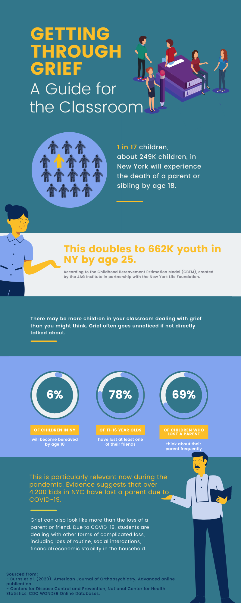

```{r setup, include=FALSE}
knitr::opts_chunk$set(echo = TRUE)
```

<br>

##### Click on the images for the full, printable PDF version

<a href="pdfs/educators.pdf" class="image fit"></a>

<a href="pdfs/classroom.pdf" class="image fit"></a>

<a href="pdfs/resources.pdf" class="image fit"></a>
<a href="pdfs/resources.pdf" class="image fit"></a>

